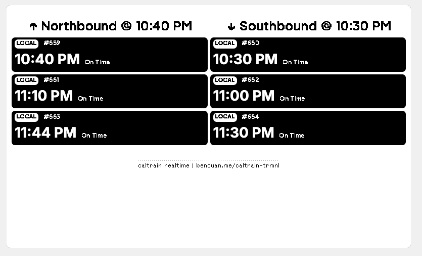

# Caltrain TRMNL Plugin

Real-time Caltrain departure times for your TRMNL e-ink display. Shows next departures for both northbound and southbound trains from your selected station.

## Quick Start

1. Download a release from the latest [releases](https://github.com/64bitpandas/trmnl-caltrain/releases)
2. Visit the TRMNL Private Plugin page (https://usetrmnl.com/plugin_settings?keyname=private_plugin)
3. Click "Import New" -> select the downloaded zip file
4. Select your Caltrain station from the dropdown
5. Choose your preferred layout
6. Set polling interval (recommended: 15 minutes)

## Layouts

| Layout          | File                     | Description                                    |
| --------------- | ------------------------ | ---------------------------------------------- |
| Full Screen     | `full.liquid`            | Split view with 3 trains per direction         |
| Half Vertical   | `half_vertical.liquid`   | Compact stacked view, 2 trains per direction   |
| Half Horizontal | `half_horizontal.liquid` | Wide compact view, 2 trains per direction      |
| Quadrant        | `quadrant.liquid`        | Minimal view showing next train each direction |

## Data Source

This plugin uses Caltrain's public GTFS real-time feed at `caltrain.com/gtfs/stops/{station}/predictions`.

## License

[MIT](LICENSE). Data provided by Caltrain.
